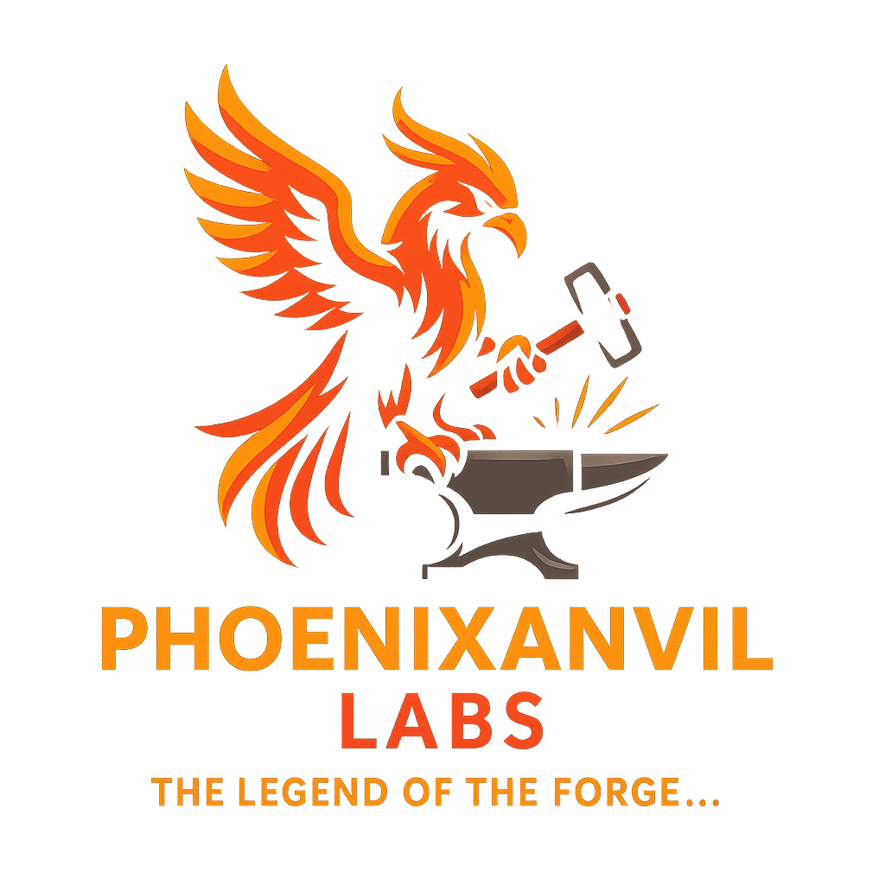

  

# 👋 Welcome to PhoenixAnvil Labs

Hi, I'm Jason — a QA Engineer, Toolmaker, and lifelong learner on a 5-year mission to build smarter systems, deeper skills, and handcrafted software one project at a time.

---

## 🧪 What I’m Building

🎯 I’m creating a portfolio of over **200+ focused developer tools** — each one thoughtfully designed, tested, and documented. Every project is built with real-world practices: versioning, issue tracking, test coverage, and docs.

Each tool lives in its own GitHub repo, is tracked in Jira (under a unified workflow), and supported with documentation via Confluence and Sphinx.

---

## ⚙️ Core Technologies

- 🐍 Python + FastAPI
- 🗃️ PostgreSQL
- 🧪 Pytest + Xray (QA-focused development)
- 🐚 Bash scripting, Regex, CLI tools
- 📚 Sphinx, Markdown, and reStructuredText
- 🧠 Jira, Confluence, Aha! Roadmaps

---

## 🔧 Dev Workflow Overview

I’ve documented my full development process—from sprint planning and time tracking to commit practices and QA workflows—right here:

👉 [View the PhoenixAnvil Labs Dev Workflow Documentation](https://jasonasmith.atlassian.net/wiki/external/ODRmNmVkMTMyYjk0NGU3ODkzYmI0ODhiZmExNTBkZDM)

This public Confluence doc walks through how I work with tools like Jira, Tempo, Confluence, GitHub, Sphinx, and Aha! Roadmaps to build professional-grade tools and systems.

---

## 🧰 Recent Tools

- 🔧 [**Stride**](https://github.com/PhoenixAnvil/stride) – Sprint/Iteration Tracker API  
- ✏️ [**Scribbly**](https://github.com/PhoenixAnvil/scribbly) – User Story Management API  
- 🔍 [**Sentinel**](https://github.com/PhoenixAnvil/sentinel) – API Monitoring + Load Testing CLI  
- 🧵 [**Thumper**](https://github.com/PhoenixAnvil/thumper) – HTTP Ping Tool for APIs  
- 🔐 [**KeyForge**](https://github.com/PhoenixAnvil/keyforge) – Secure Password Generator CLI

Each tool is tracked via Jira epics, includes automated and manual testing, and has a roadmap in Aha! with full QA/test alignment.

---

## 🎯 Current Focus

📚 I’m currently in **certification sprint mode**, preparing for the ISTQB CTFL (QA Certification) scheduled for **April 30, 2025**.  
Until then, I’ll be in **low-power commit mode**—maintaining my GitHub streak with meaningful but lighter contributions each day.

🛠️ I actively use:
- **Jira** for issue tracking and sprint management
- **Confluence** for documentation and knowledge sharing
- **Aha! Roadmaps** to manage product visions and strategic planning for each tool

> 🚀 My full Jira, Confluence, and Aha! setup is available for walkthroughs or demos upon request—for recruiters, collaborators, and hiring managers.

---

### 🔢 Versioning Philosophy

All PhoenixAnvil Labs tools follow [Semantic Versioning 2.0.0](https://semver.org/).

We treat versions as a contract with users: predictable, incremental, and clearly communicated.

For release patterns and development workflow, see our [Documentation Portal](https://jasonasmith.atlassian.net/wiki/external/ODRmNmVkMTMyYjk0NGU3ODkzYmI0ODhiZmExNTBkZDM).

---

## 📚 What’s Ahead

- 🐧 LPIC-1 Linux Certification (May 28, 2025)
- 🧪 Deeper QA Automation (Playwright, Selenium, Appium)
- 🛠️ Building out 50+ Python/FastAPI tools for my portfolio
- 🚀 PyPI packaging and CLI test frameworks
- 📦 Real-world CI/CD, GitHub Actions, and versioning

---

## 🧠 What Drives Me

- ✅ Real tools > tutorials  
- ✅ Clean code + logs + tests = confidence  
- ✅ Progress > perfection  
- ✅ Sharpening the craft every day

---

## 📫 Let’s Connect

- 🔗 [LinkedIn](https://www.linkedin.com/in/jason-alan-smith)
- 💬 Want a walkthrough of my development workflow in Jira, Confluence, and Aha!?  
  Feel free to reach out:  
  📧 **Jason.Smith@phoenixanvilabs.dev**

---

> Built at **PhoenixAnvil Labs** – Where ideas are forged into tools. 🔥🛠️
